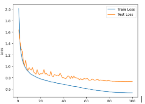
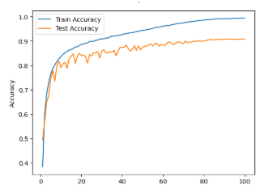

# CNN Model for Image Classification

## Introduction

This project implements a convolutional neural network (CNN) for image classification, achieving strong generalization and high accuracy. The model is designed with modular blocks and several training enhancements to optimize performance and prevent overfitting.

## Results

The following plots show the evolution of loss and accuracy during training:

_Diagram: Evolution of Train and Test Losses_

- Both train and test loss decrease and stabilize around 100 epochs, indicating good learning with minimal overfitting.

_Diagram: Evolution of Train and Test Accuracies_

- Training accuracy rises steadily, and test accuracy plateaus around 90% without overfitting.

## Model Architecture

- **Stem:**

  - 3×3 convolution over 3 input channels (RGB), outputting 32 feature maps.
  - ReLU activation for non-linearity.

- **Backbone Blocks:**

  - Each block has two branches:
    - **Expert Branch:**
      - Adaptive average pooling, two fully connected layers (FC), and softmax to generate k weights.
      - First FC reduces input by r, second expands to k.
      - Weights determine the contribution of k convolutional paths.
    - **Convolutional Branch:**
      - k parallel 3×3 conv layers (with batch norm).
      - Outputs are combined using expert branch weights.
  - Output is added to a skip connection (identity or 1×1 conv), followed by ReLU (like ResNet residual block).

- **Classifier:**
  - Global average pooling.
  - MLP with 3 fully connected layers, ReLU, and dropout.
  - Final output size: 10 (for 10 classes).

## Block Details

| Block   | Input | Output | k   | r   |
| ------- | ----- | ------ | --- | --- |
| Block 1 | 32    | 64     | 4   | 8   |
| Block 2 | 64    | 128    | 6   | 4   |
| Block 3 | 128   | 256    | 6   | 4   |
| Block 4 | 256   | 512    | 6   | 4   |

- k: Number of parallel paths (increases in deeper layers)
- r: Compression factor (higher in early layers)

## Hyperparameters

| Hyperparameter        | Value            | Explanation                                                     |
| --------------------- | ---------------- | --------------------------------------------------------------- |
| Initial learning rate | 0.001            | Stable and fast training (Adam); 0.01 better than 0.1           |
| Weight Decay          | 0.0005           | Regularizes weights to prevent overfitting                      |
| Optimizer             | Adam             | Adaptive learning rate; better than SGD for this model          |
| LR scheduler          | Cosine Annealing | Smoothly reduces LR after each epoch                            |
| Loss Function         | CrossEntropyLoss | Standard for classification; label smoothing for generalization |
| Batch Size            | 256              | Suitable for dataset size                                       |
| Epochs                | 100              | Sufficient for model to reach 90% accuracy                      |
| k                     | 4, 6, 6, 6       | Fewer paths early, more in deeper layers                        |
| r                     | 8, 4, 4, 4       | More compression early, less in deeper layers                   |

## Training Techniques

- **Weight Initialization:** Kaiming initialization for Conv2d and Linear layers (optimized for ReLU).
- **Dropout:** 0.3 and 0.4 in classifier to prevent overfitting.
- **Batch Normalization:** Applied in every conv branch for faster, more stable training.
- **Data Augmentation:** RandomHorizontalFlip and random crop (via torchvision transforms) to improve generalization.

---

For more details, see the code and comments in the repository.
